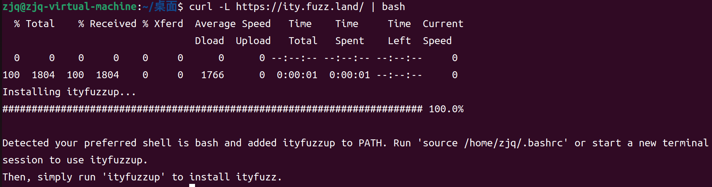
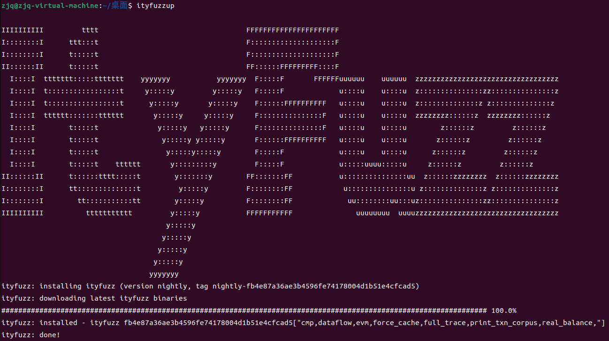
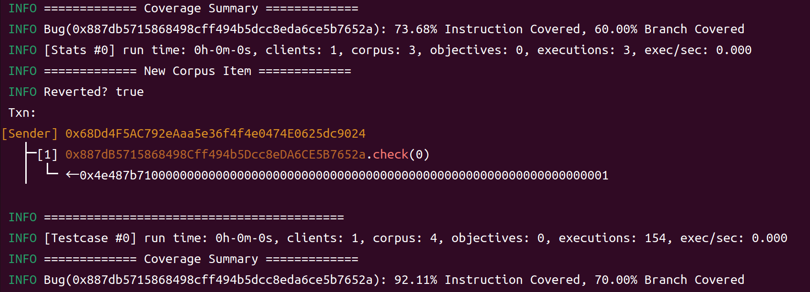
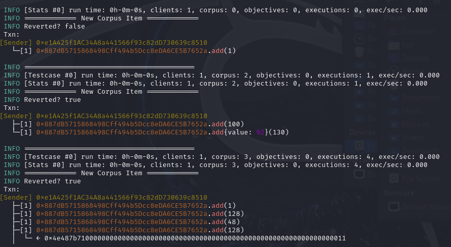
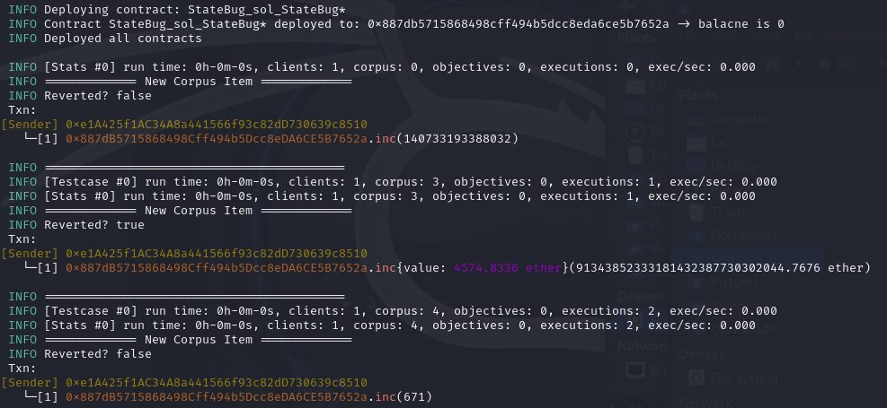
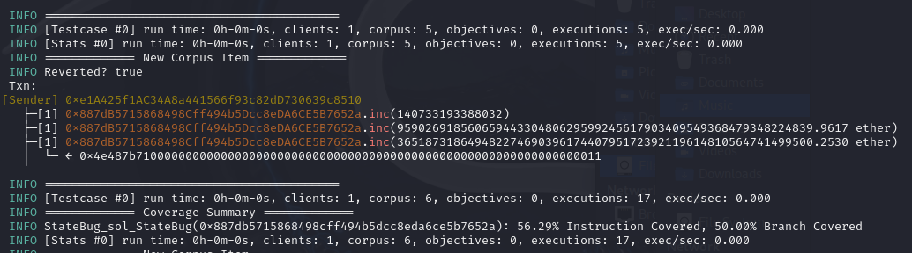
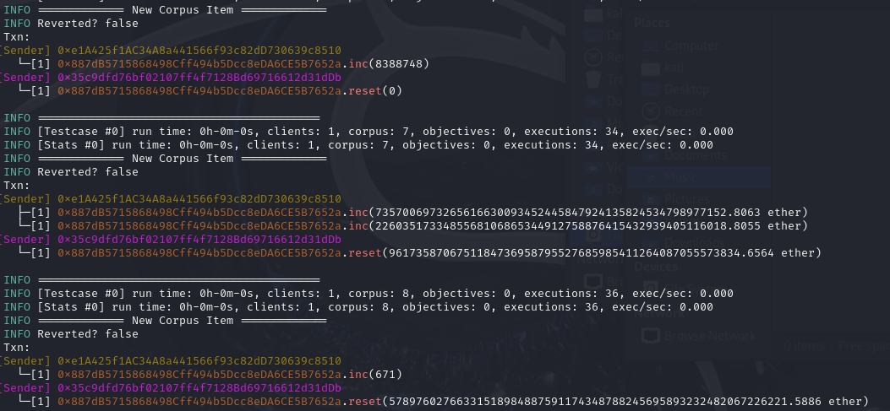

# ITYFuzz

## 环境配置

||操作系统|Rust|Solidity|Node|ITYFuzz|
|-|-|-|-|-|-|
|版本|Ubuntu22.04|1.92.0|0.8.20|22.21.1|fb4e87a36ae3b4596fe74178004d1b51e4cfcad5|

## 安装步骤

针对Ubuntu裸机，首先配置需要使用的Ubuntu系统命令
```bash
sudo apt upgrade

sudo apt install -y build-essential libssl-dev libz3-dev pkg-config cmake clang git curl
```

配置Rust环境
```bash
curl --proto '=https' --tlsv1.2 -sSf https://sh.rustup.rs | sh

# 完成后另开一个终端激活环境变量
source "$HOME/.cargo/env"

# 利用以下命令检查Rust是否配置成功
rustc --version
```

配置Solidity环境
```bash
sudo apt install npm

sudo apt install nodejs

curl -o- https://raw.githubusercontent.com/nvm-sh/nvm/v0.39.7/install.sh | bash

source ~/.bashrc

nvm install 22

sudo apt install -y python3-pip

python3 -m pip install solc-select

export PATH=$PATH:~/.local/bin

solc-select install 0.8.20

solc-select use 0.8.20
```

配置[ITYFuzz](https://github.com/fuzzland/ityfuzz)环境
```bash
curl -L https://ity.fuzz.land/ | bash

# 另起一个终端
ityfuzzup
```




#### 测试环境
```bash
mkdir repo

cd repo

touch Bug.sol
```
修改`Bug.sol`
```solidity
pragma solidity ^0.8.0;

contract Bug {
	function check(int a) public pure {
	    if (a == 1337) {
		    assert(false);
	    }
	}
}
```
测试ITYFuzz
```bash
# 会在目录下生成Bug.bin和Bug.abi文件
solc Bug.sol --bin --abi --optimize -o . --overwrite

ityfuzz evm -t ./Bug.bin
```

如果测试结果如下图所示，则代表ITYFuzz安装成功。在下图中ITYFuzz找到了一个BUG，并且覆盖率达到了92.11%。
+ `0x4e487b71`:指的是Solidity内置的`Panic(uint256)`错误的函数选择器。
+ `...0001`:Panic的错误代码，`0x01`对应的是`assert`失败。



## 运行指南
ItyFuzz 支持 EVM 和 Move 智能合约的链下（本地）模糊和链上（叉）模糊。

### Onchain Fuzzing (EVM)
要运行链上模糊测试活动，指定目标合约和要分叉的链。
```bash
# -t [TARGET_ADDR]: specify the target contract
# --onchain-block-number [BLOCK]: fork the chain at block number [BLOCK]
# -c [CHAIN_TYPE]: specify the chain

ityfuzz evm\
    -t [TARGET_ADDR]\
    --onchain-block-number [BLOCK]\
    -c [CHAIN_TYPE]\
    --onchain-etherscan-api-key [Etherscan API Key] # (Optional) specify your etherscan api key
```
例如，要在以太坊上针对 WETH 运行链上模糊搜索活动，运行：
```bash
# -t [TARGET_ADDR]: specify the target contract
# --onchain-block-number [BLOCK]: fork the chain at block number [BLOCK]
# -c [CHAIN_TYPE]: specify the chain
# -f: (Optional) allow attack to get flashloan

ityfuzz evm\
    -t 0xc02aaa39b223fe8d0a0e5c4f27ead9083c756cc2\
    --onchain-block-number 0\
    -c ETH\
    --onchain-etherscan-api-key [Etherscan API Key]\
    -f
```
ItyFuzz 会从 Etherscan 拉取合同的 ABI 并进行模糊处理。如果 ItyFuzz 在内存中遇到未知槽，它会从链 RPC 中拉取该槽。如果 ItyFuzz 遇到调用外部未知合同，它会拉取该合同的字节码和 ABI。如果其 ABI 不可用，ItyFuzz 会反编译并获取 ABI。

### Offchain Fuzzing (EVM)
要运行本地模糊测试活动，请指定目标合约（只需字节码和 ABI）。
```bash
# -t [BUILD DIRECTORY GLOB]: specify the targets directory
# -f: (Optional) allow attack to get flashloan
# --concolic: (Optional) enable concolic execution
# --concolic-caller: (Optional) enable concolic execution to change caller to anyone

ityfuzz evm\
    -t "[BUILD DIRECTORY GLOB]"\
    -f\
    --concolic --concolic-caller
```
例如，在一个汇编的单一合同上运行一个简单的模糊测试活动：
```bash
ityfuzz evm -t './build/*'
```
ItyFuzz 会尝试将目录中的所有工件部署到没有其他智能合约的区块链上。
具体来说，项目目录应包含几个 [X].abi 和 [X].bin 文件。例如，要模糊一个名为 main.sol 的合同，你应该确保 main.abi 和 main.bin 存在于项目目录中。fuzzer 会自动检测目录中的合约及其之间的关联（参见 tests/evm/multi-contract），并对它们进行模糊处理。  
如果 ItyFuzz 未能推断合同间的相关性，可以添加 [X].address，其中 [X] 是合同名称，用于指定合同地址。   
要定义自定义不变量，可以查看 Custom Invariant 或 Echidna / Scribble Support。

注意事项：
请记住，ItyFuzz 是在干净的区块链上进行模糊检测，因此你应确保所有相关合约（例如 ERC20 代币、Uniswap 等）都已部署到区块链上，再进行模糊搜索。

### Offchain Fuzzing (MoveVM)
使用 sui move build 编译合约并运行 ItyFuzz：
```bash
# build example contract that contains a bug
cd ./tests/move/share_object
sui move build

# get back to ItyFuzz and run fuzzing on the built contract
cd ../../../
ityfuzz move -t "./tests/move/share_object/build"
```

#### Defining Invariants
你可以在合同中发出 AAAA__fuzzland_move_bug 事件，在发现漏洞时报告状况。
```bash
// define the event struct
use sui::event;

struct AAAA__fuzzland_move_bug has drop, copy, store {
    info: u64
}

... 
    // inside function
    event::emit(AAAA__fuzzland_move_bug { info: 1 });
...
```

### 案例研究
### case 1
Bug.sol 定义了一个简单的合约，其中函数 check(int a) 在 a 等于 1337 时触发断言失败。

```json
pragma solidity ^0.8.0;

contract Bug {
    function check(int a) public pure {
        if (a == 1337) {
            assert(false);
        }
    }
}
```

ItyFuzz 在部署合约后，对 check(int) 函数的参数进行随机模糊测试。

起初，Fuzzer 使用随机的大整数作为输入，函数正常执行，用于探索代码路径并建立覆盖率。

随后，在不断基于覆盖率反馈变异参数的过程中，Fuzzer 生成了输入 1337，
命中条件判断并触发 assert(false)，导致交易回滚并返回断言失败错误码 0x4e487b71。

该异常执行被自动记录为新的测试用例，覆盖率明显提升，表明该输入成功触达了隐藏的错误路径。

该 case 表明 ItyFuzz 能够在无人工引导的情况下，自动发现由特定输入触发的逻辑漏洞，并生成可复现的触发用例。

### Case 2
Overflow.sol 定义了一个简单的合约，其中函数 add(uint8 value) 会对内部 counter 累加。
由于 counter 是 uint8 类型，超过 255 会发生整数溢出。

```json
pragma solidity ^0.8.0;

contract Overflow {
    uint8 public counter = 0;

    function add(uint8 value) public {
        counter += value; // 可能溢出
        assert(counter >= value); // 断言检测溢出
    }
}
```
合约被编译为 EVM 字节码并作为 ItyFuzz 的输入目标。
ItyFuzz 自动部署合约，并对 add 函数的参数进行模糊测试。

ItyFuzz 在启动后首先自动部署目标合约 Bug，并枚举其可调用的公共函数 check(int) 作为模糊测试入口。

ItyFuzz 在部署合约后，对 add(uint256) 函数进行参数与调用序列的模糊测试。

首先，Fuzzer 生成小整数输入（如 add(1)、add(100)），用于初始化状态变量 x 并探索正常执行路径。

在覆盖率反馈的引导下，Fuzzer 自动组合多次函数调用，逐步累积 x 的值，形成状态相关的调用序列。

当连续调用导致 x 在 unchecked 块中发生整数回绕（wrap-around）时，条件 x < a 成立，触发 assert(false)，交易回滚并返回 panic 错误码 0x4e487b71。

该异常执行路径被记录为新的测试用例，表明 ItyFuzz 成功发现了依赖多次状态更新才能触发的整数溢出漏洞。该 case 表明 ItyFuzz 能够自动探索整数边界条件，发现隐蔽的溢出漏洞。

### Case 3
StateBug.sol 定义了一个带有状态依赖逻辑的合约，其中 inc(uint256 x) 用于累加内部变量 counter，并在其超过阈值时进入危险状态 armed。
在 armed 状态下，reset(uint256 x) 可以将 counter 重置为一个较小的值。
当合约同时满足 armed == true 且 counter == 7 时，调用 check() 将触发断言失败，从而暴露一个需要跨多次调用才能触发的隐藏状态漏洞。

```c
pragma solidity ^0.8.0;

contract StateBug {
    uint256 public counter;
    bool public armed;

    function inc(uint256 x) public {
        // 正常状态推进
        counter += x;

        // 当 counter 足够大时，进入“危险状态”
        if (counter > 1000) {
            armed = true;
        }
    }

    function reset(uint256 x) public {
        // 只有在 armed 状态下才允许 reset
        if (armed && x < 10) {
            counter = x;
        }
    }

    function check() public view {
        // 隐藏漏洞：需要特定状态组合
        if (armed && counter == 7) {
            assert(false);
        }
    }
}
```


**第一段：状态建模与初始状态探索**


ITYFuzz 在分析该合约时，并不是把每个函数调用当作孤立事件，而是将合约建模为一个 有状态系统（stateful contract）。
在这个模型中：
- counter 和 armed 构成了合约的核心状态
- inc 和 reset 被视为 状态转移函数

不同交易序列会导致不同的状态组合

例如：
- inc(x) 会改变 counter，并在 counter > 1000 时将 armed 置为 true
- reset(x) 的执行效果依赖于 之前是否已经进入 armed 状态

因此，fuzzer 的目标不只是“让函数跑一遍”，而是通过**多笔交易组合**探索合约可能达到的所有状态空间。


**第二段：状态反馈驱动的状态推进**


在 fuzzing 过程中，ITYFuzz 会记录每次执行后的合约状态和分支覆盖情况，并将能够引发新状态或新分支的交易序列加入 corpus。

小参数的 inc(x)
→ counter 增长有限，armed 仍为 false
→ 状态变化较少，但用于构建初始 corpus

大参数的 inc(x)
→ counter > 1000 分支被触发
→ armed 从 false 变为 true（这是一个新的关键状态）

一旦 armed == true 被覆盖，后续的 fuzzing 就会优先围绕该状态继续变异输入，例如：
- 尝试不同的 reset(x)
- 尝试在该状态下调用只读函数 check()

它们并非随机噪声，而是为了尽快跨越状态阈值。


**第三段：跨交易状态组合，触发隐藏断言**



Fuzzer 在 armed 状态下发现：
```c
function reset(uint256 x) public {
    if (armed && x < 10) {
        counter = x;
    }
}
```
于是它开始系统性探索：
- armed == true
- 尝试各种 x < 10
- 将 counter 精确写成小值（0, 7, 8, …）

这一步非常关键，因为这是 单次调用 fuzzer 永远无法做到的事

当 fuzzer 构造出：
```c
inc(large) → armed = true
reset(7)   → counter = 7
```

随后再调用：
```c
check()
```

就会命中：
```c
if (armed && counter == 7) {
    assert(false);
}
```

对应 EVM panic：0x4e487b71

| Fuzzing 阶段 | 日志表现           | 对应机制                 |
| ---------- | -------------- | -------------------- |
| 初始建模       | 单次 `inc(x)`    | 识别状态变量与转移函数          |
| 状态推进       | 巨大 `inc(x)`    | 覆盖 `armed = true` 分支 |
| 状态组合       | `inc → reset`  | 构造跨交易状态              |
| 漏洞触发       | revert / panic | 断言失败被识别              |
